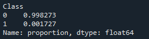
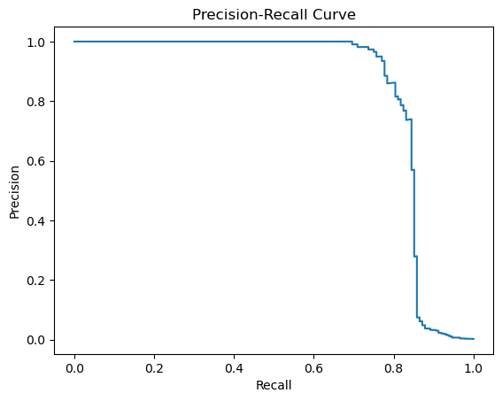
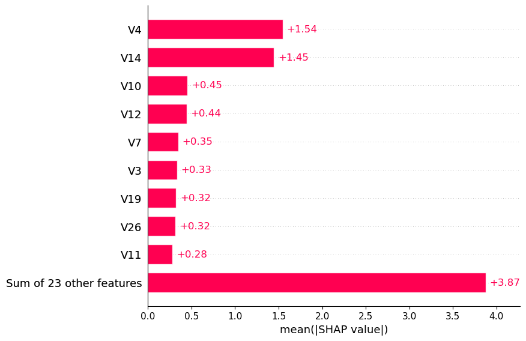

# Detecção de Fraudes em Cartões de Crédito

Projeto desenvolvido durante um bootcamp com o objetivo de aplicar técnicas de Machine Learning para identificação de transações fraudulentas utilizando um conjunto de dados real.

O projeto contempla uma análise exploratória simples, preparação dos dados, treinamento de diferentes modelos de classificação e avaliação dos resultados.

---

## Requisitos

As principais bibliotecas utilizadas no ambiente Python 3.12.4 foram:

| Biblioteca | Versão |
|------------|---------|
| pandas | 2.2.2 |
| numpy | 1.26.4 |
| matplotlib | 3.8.4 |
| scikit-learn | 1.5.2 |
| xgboost | 2.1.1 |
| shap | 0.46.0 |

---

## Dataset

Foi utilizada a base pública de fraudes em cartões de crédito disponibilizada pelo TensorFlow.

O conjunto contém milhares de transações financeiras, onde:

- **Class = 0** → transação legítima;
- **Class = 1** → fraude.

As variáveis originais foram anonimizadas por meio de PCA para preservar informações sensíveis, permanecendo apenas as colunas **Time**, **Amount** e a variável alvo (**Class**) em formato original.

---

## Objetivo

Construir modelos capazes de identificar transações fraudulentas em um cenário altamente desbalanceado.

Como fraudes representam apenas uma pequena parcela da base, métricas tradicionais como acurácia não são suficientes para avaliar o desempenho do modelo.

Por esse motivo, a avaliação foi baseada principalmente em **Precision** e **Recall**.

---

## Fluxo do projeto

O desenvolvimento foi dividido nas seguintes etapas:

1. Importação das bibliotecas;
2. Carregamento da base de dados;
3. Análise inicial;
4. Feature Engineering;
5. Treinamento dos modelos;
6. Avaliação;
7. Análise da importância das variáveis.

---

## Análise inicial

Inicialmente foram realizadas algumas verificações da base:

- visualização das primeiras linhas;
- estatísticas descritivas;
- procura por valores ausentes;
- distribuição das classes.

A análise mostrou que a base é **fortemente desbalanceada**, com as fraudes representando apenas uma pequena fração das observações.

<p align="center">

</p>

Esse desbalanceamento influencia diretamente a escolha das métricas e dos modelos utilizados.

---

## Feature Engineering

Foram realizadas duas transformações sobre a variável **Amount**:

- criação de uma versão em escala logarítmica (`Amount_log`), reduzindo a grande dispersão dos valores;
- normalização da variável utilizando **StandardScaler**, gerando a coluna `Amount_scaled`.

Posteriormente os dados foram divididos em conjuntos de treino e teste utilizando amostragem estratificada.

---

## Modelos utilizados

Foram treinados três algoritmos de classificação:

- Logistic Regression
- Random Forest
- XGBoost

Cada modelo foi treinado utilizando o conjunto de treino e posteriormente avaliado no conjunto de teste.

---

## Avaliação

Como o problema apresenta forte desbalanceamento entre as classes, a análise foi baseada principalmente em:

- Precision;
- Recall;
- Curva Precision-Recall;
- Classification Report.

Abaixo é apresentada a curva Precision-Recall obtida para o modelo XGBoost.

<p align="center">

</p>

Embora o XGBoost tenha apresentado o melhor desempenho entre os modelos avaliados, os resultados ainda indicam dificuldade em identificar fraudes com elevada precisão.

---

## Importância das variáveis

Também foi realizada uma análise da importância das variáveis utilizando:

- Feature Importance do Random Forest;
- Feature Importance do XGBoost;
- SHAP.

Abaixo é apresentado o gráfico de importância do modelo XGBoost.

<p align="center">

</p>

Essa etapa permite compreender quais atributos exercem maior influência nas decisões do modelo.

---

## Possíveis melhorias

Como a base apresenta forte desbalanceamento, alguns experimentos poderiam aumentar o desempenho dos modelos:

- aplicação de **undersampling** da classe majoritária;
- utilização de técnicas de geração de amostras sintéticas, como **SMOTE**;
- ajuste de hiperparâmetros;
- comparação com outros algoritmos de classificação.

Cada uma dessas abordagens exigiria um novo treinamento e uma nova avaliação dos modelos.

---

## Estrutura do repositório

```
analise-de-fraudes/
│
├── imagens/
│   ├── distribuicao_classes.png
│   ├── precision_recall_xgboost.png
│   └── importancia_variaveis.png
│
├── analise_fraudes.py
└── README.md
```
