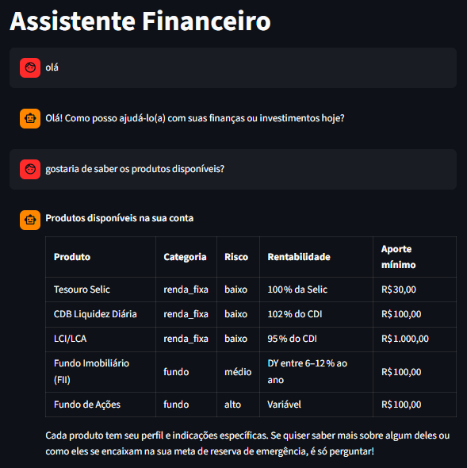
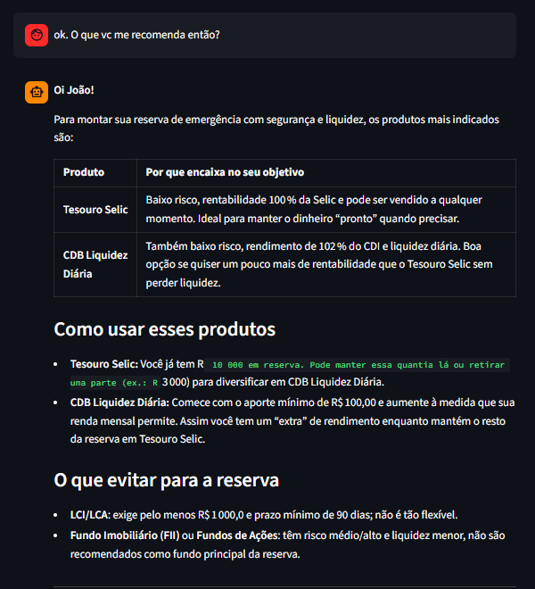
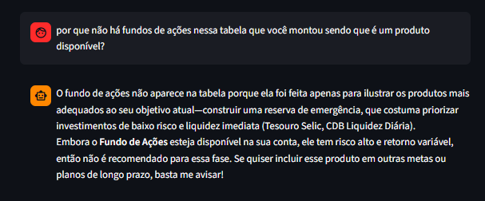

# Avaliando o Chatbot com um Exemplo

  Foram feitas perguntas ao Assistente Financeiro para atestar seu funcionamento. Abaixo serão mostrados prints das perguntas, das respostas e a intenção de cada uma será explicada

## **Pergunta 1 e 2**

  

  Uma saudação simples foi feita e, em seguida, o modelo foi questionado sobre quais os produtos disponíveis para investir. Os dados dos produtos, inicialmente passados como JSON, foram convertidos em uma tabela com suas informações principais, mantendo a resposta simples e curta, mas completa para entendimento.

## **Pergunta 3**

  

  Propositalmente, produtos não listados foram mencionados como sendo a intenção do usuário. A resposta, como esperado, deixava claro que não estão disponíveis e sugeriu ajuda para algo do catálogo atual, mostrando a correta interpretação dos dados de entrada e a não invenção de informações.

## **Pergunta 4**

  

  Dessa vez, foi pedido uma sugestão para o assistente, que recomendou os produtos de melhor rendimento para risco baixo, mostrando ter compreendido o perfil moderado do cliente.
  De brinde, ainda descartou quais aplicações devem ser evitadas por conta do risco envolvido.

## **Pergunta 5**

  

  Por fim, o modelo foi questionado do porquê de um produto não ter sido recomendado. Novamente, os dados do cliente foram usados para explicar que o produto em questão é incompatível com o perfil e necessidade atual do cliente.

## **Conclusão**

  Essas perguntas conseguiram atestar o que mais era esperado do Assistente Financeiro:
  - Os dados de entrada foram corretamente interpretados;
  - As respostas foram simples, mas capazes de sanar dúvidas;
  - Embora amplamente conhecidos, o chatbot não inventou informações sobre os investimentos que ele desconhecia, deixando claro que não sabia sobre o assunto;
  - Foi capaz de responder dúvidas sobre os produtos e sugerir o que é adequado para o cliente.
