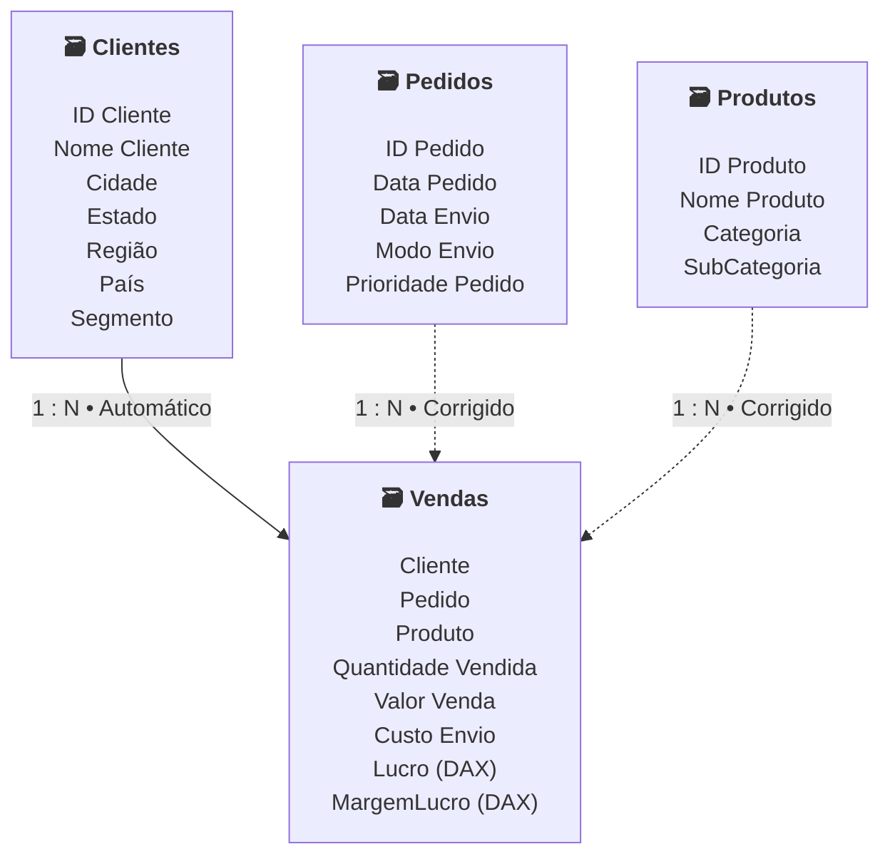

# **WORK IN PROGRESS**
# **Microsoft Power BI Para Business Intelligence e Data Science - DSA**

Diretório criado para publicação dos dashboards criados durante esse curso da Data Science Academy.  
Cada relatório possui dados e perguntas diferentes. Por conta disso, diferentes visualizações e recursos do Power BI foram usados para cada criação. 
As bases de dados foram disponibilizadas pela DSA, possuem dados fictícios e podem ser acessadas pelos próprios arquivos.  
Cada projeto será brevemente explicado adiante, com seu próprio modelo de dados ou, quando houver apenas uma tabela, suas 5 primeiras linhas para exemplificação do conteúdo. Um print de cada relatório será anexado, todos disponíveis em `imagens`.

---
## **Destaques do Curso**

- Apresentação de diferentes áreas de negócio, seus principais indicadores e dicas de criação de dashboards para cada;
- Uso e explicação de diversas visualizações, inclusive algumas recentes e dinâmicas, como **Narrativa Inteligente** e **Principais Influenciadores**;
- Explicação e uso da segmentação de dados;
- Dicas e aplicação de diferentes formatações para os vários visuais;
- Introdução ao Power Query com usos como Remoção de Duplicações, Substituição de Valores, Exclusão de Linahs e Transposição;
- Introdução à Modelagem de Dados;
- Introdução e uso de DAX;
- Introdução e uso de M Language;
- Uso de Python, R e SQL no Power BI;
- Laboratórios com temas típicos de Data Science no Power BI

---
## **Relatórios Desenvolvidos**
Há dois tipos de relatórios desenvolvidos: os **Laboratórios**, que envolve a criação de dashboards generalistas e os **Miniprotos**, com criação voltada a diferentes áreas de negócios.

### **lab1: Laboratório Prático 1 - Dashboard Analítico de Vendas Globais**

##### **Dados e Modelos de Dados**

Apesar de ser uma tabela única, ela foi dividida em 2 tabelas para melhorar a visualização. A tabela de baixo está imediatamente à esquerda da tabela de cima nos dados originais e no relatório.

| ID_Pedido      | Data_Pedido | ID_Cliente | Segmento    | Regiao     | Pais          | Product ID      |
| -------------- | ----------- | ---------- | ----------- | ---------- | ------------- | --------------- |
| US-2012-129007 | 13/09/2012  | KD-16615   | Corporativo | California | United States | OFF-PA-10000994 |
| CA-2014-11671  | 03/09/2014  | VW-21775   | Corporativo | California | United States | OFF-PA-10004475 |
| CA-2013-159345 | 18/06/2013  | IG-15085   | Consumidor  | California | United States | OFF-PA-10000806 |
| CA-2014-124716 | 28/03/2014  | BD-11560   | Home Office | California | United States | OFF-PA-10001144 |
| CA-2013-106460 | 16/02/2013  | GT-14710   | Consumidor  | California | United States | OFF-PA-10001736 |

| Categoria   | SubCategoria | Total_Vendas | Quantidade | Desconto |   Lucro | Prioridade |
| ----------- | ------------ | -----------: | ---------: | -------: | ------: | ---------- |
| Suprimentos | Paper        |       209,70 |          2 |        0 | 100,656 | Critico    |
| Suprimentos | Paper        |       109,92 |          2 |        0 | 53,8608 | Alto       |
| Suprimentos | Paper        |       111,96 |          2 |        0 | 54,8604 | Alto       |
| Suprimentos | Paper        |       110,96 |          2 |        0 | 53,2608 | Alto       |
| Suprimentos | Paper        |        70,88 |          2 |        0 | 33,3136 | Critico    |

##### **Perguntas**

1. Qual o valor total vendido?
2. Quantas vendas foram realizadas por categoria de produto?
3. Quantas vendas foram realizadas por país considerando a prioridade de entrega?
4. Qual foi a média de desconto nas vendas por subcategoria de produto?
5. Quais países tiveram maior média de valor de venda? Demonstre em um mapa.

---

### **lab2: Laboratório Prático 2 - Dashboard de Vendas, Custo, Margem de Lucro e KPI**

##### **Dados e Modelos de Dados**

Esse relatório possui 4 fontes de dados, que formam um modelo relacional.  
As relações indicadas com *Corrigido* foram criadas no decorrer das aulas, devido a erros intencionalmente colocados nos dados para trabalhar ajustes finos neles.  
Entretanto, as bases originais ainda podem ser consultadas. 

Abaixo está o modelo de dados final:

##### **Perguntas**

1. Qual foi o total de valor venda considerando cada modo de envio dos pedidos? Use um gráfico de cascata.
2. Quais mercados tiveram o maior custo médio de envio dos produtos vendidos? Use um gráfico treemap.
3. A empresa tem como objetivo (meta) manter uma média de 350 para o valor de venda todos os meses. Mostre um indicador (KPI – Key Performance Indicator) com o valor médio de venda. A empresa ficou abaixo ou acima da meta no mês de Abril/2014?
4. Considere que o lucro é equivalente a: valor venda - custo envio. Qual categoria de produto apresentou maior lucro médio.
5. Qual foi o comportamento da margem de lucro ao longo do tempo? Considere a margem de lucro como o lucro dividido pelo valor venda.

---

### **mp1: Miniprojeto 1 - Análise de Campanhas de Marketing com Power BI**

Print da aba `Visão Comportamento`. Há outras 3 abas no relatório.

##### **Dados e Modelos de Dados**

Apenas uma tabela de dados. Foi divida em partes para melhorar a visualização. Os IDs de cada linha foram mantidos para facilitar o entendimento dessa divisão.

| ID | Ano Nascimento | Escolaridade | Estado Civil | Salario Anual | Filhos em Casa | Adolescentes em Casa | Data Cadastro | Dias Desde Ultima Compra |
|---:|---:|---|---|---:|---:|---:|---|---:|
| 5758 | 1982 | Curso Superior | Solteiro | 65169 | 0 | 0 | segunda-feira, 1 de fevereiro de 2021 | 23 |
| 9855 | 1952 | Doutorado | Solteiro | 62000 | 0 | 1 | sábado, 8 de abril de 2023 | 25 |
| 10022 | 1973 | Doutorado | Solteiro | 54466 | 1 | 1 | domingo, 2 de setembro de 2018 | 78 |
| 10350 | 1950 | Doutorado | Solteiro | 54432 | 2 | 1 | sábado, 5 de setembro de 2020 | 37 |
| 5062 | 1963 | Doutorado | Solteiro | 54072 | 1 | 1 | terça-feira, 7 de março de 2023 | 71 |

| ID | Gasto com Eletronicos | Gasto com Brinquedos | Gasto com Moveis | Gasto com Utilidades | Gasto com Alimentos | Gasto com Vestuario | Numero de Compras com Desconto | Numero de Compras na Web | Numero de Compras via Catalogo | Numero de Compras na Loja | Numero Visitas WebSite Mes |
|---:|---:|---:|---:|---:|---:|---:|---:|---:|---:|---:|---:|
| 5758 | 1074 | 0 | 69 | 0 | 0 | 46 | 1 | 10 | 4 | 13 | 6 |
| 9855 | 899 | 0 | 101 | 0 | 0 | 20 | 1 | 6 | 6 | 13 | 4 |
| 10022 | 12 | 0 | 4 | 0 | 0 | 0 | 1 | 1 | 0 | 2 | 5 |
| 10350 | 33 | 0 | 5 | 0 | 0 | 0 | 1 | 1 | 0 | 3 | 4 |
| 5062 | 35 | 0 | 4 | 0 | 0 | 0 | 1 | 2 | 0 | 2 | 8 |

| ID | Compra na Campanha 1 | Compra na Campanha 2 | Compra na Campanha 3 | Compra na Campanha 4 | Compra na Campanha 5 | Comprou | Pais |
|---:|---:|---:|---:|---:|---:|---|---|
| 5758 | 1 | 0 | 1 | 1 | 1 | Sim | Estados Unidos |
| 9855 | 0 | 0 | 0 | 0 | 0 | Não | Estados Unidos |
| 10022 | 0 | 0 | 0 | 0 | 0 | Não | Estados Unidos |
| 10350 | 0 | 0 | 0 | 0 | 0 | Não | Estados Unidos |
| 5062 | 0 | 0 | 0 | 0 | 0 | Não | Espanha |

##### **Perguntas**

Não foram feitas perguntas, mas foi solicitado a criação de 4 diferentes visões, que tornaram-se, cada uma, uma página no relatório. As visões pedidas são:

1. Visão do Cliente
2. Visão do Comportamento de Compra do Cliente
3. Visão da Performance das Campanhas de Marketing
4. Visão dos Padrões de Compra no Ponto de Venda (País)