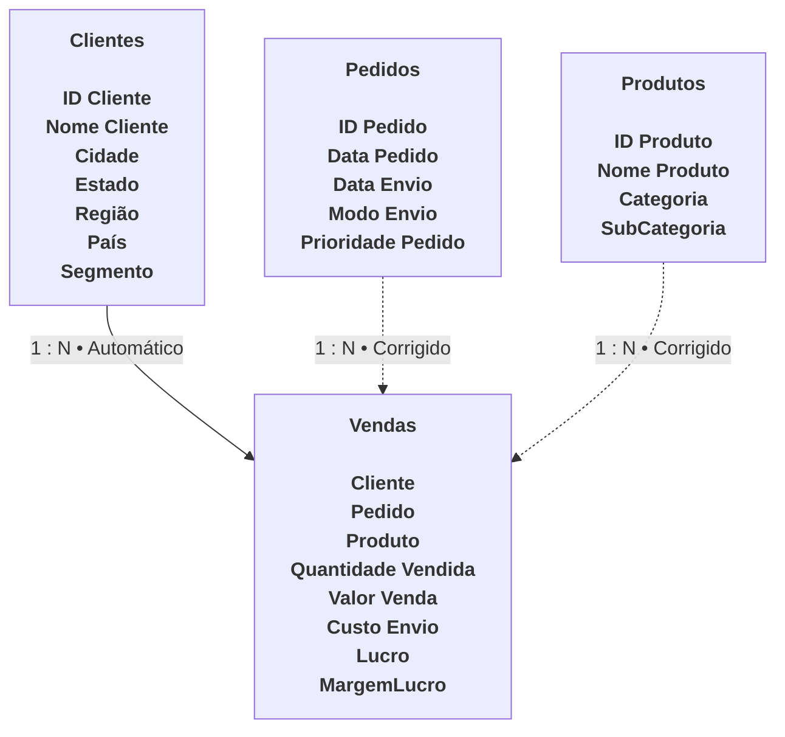

# **WORK IN PROGRESS**
# **Microsoft Power BI Para Business Intelligence e Data Science - DSA**

Repositório criado para publicação dos dashboards criados durante esse curso da Data Science Academy.  
Cada relatório possui diferentes dados e perguntas a serem respondidas, bem como diferentes ferramentas do Power BI usadas para sua criação.  
As bases de dados foram disponibilizadas pela DSA, possuem dados fictícios e podem ser acessadas pelos próprios arquivos.

---

## **Lab1: Laboratório Prático 1 - Dashboard Analítico de Vendas Globais**

Relatório criado como introdução ao curso.

#### **Dados e Modelos de Dados**

Apenas um dataset foi usado para criar esse relatório. Um exemplo das primeiras linhas pode ser visualizado abaixo.  
Apesar de ser uma tabela única, ela foi dividida em 2 tabelas para melhorar a visualização. A tabela de baixo está imediatamente à esquerda da tabela de cima nos dados originais e no relatório.

| ID_Pedido      | Data_Pedido | ID_Cliente | Segmento    | Regiao     | Pais          | Product ID      |
| -------------- | ----------- | ---------- | ----------- | ---------- | ------------- | --------------- |
| US-2012-129007 | 13/09/2012  | KD-16615   | Corporativo | California | United States | OFF-PA-10000994 |
| CA-2014-11671  | 03/09/2014  | VW-21775   | Corporativo | California | United States | OFF-PA-10004475 |
| CA-2013-159345 | 18/06/2013  | IG-15085   | Consumidor  | California | United States | OFF-PA-10000806 |
| CA-2014-124716 | 28/03/2014  | BD-11560   | Home Office | California | United States | OFF-PA-10001144 |
| CA-2013-106460 | 16/02/2013  | GT-14710   | Consumidor  | California | United States | OFF-PA-10001736 |

| Categoria   | SubCategoria | Total_Vendas | Quantidade | Desconto |   Lucro | Prioridade |
| ----------- | ------------ | -----------: | ---------: | -------: | ------: | ---------- |
| Suprimentos | Paper        |       209,70 |          2 |        0 | 100,656 | Critico    |
| Suprimentos | Paper        |       109,92 |          2 |        0 | 53,8608 | Alto       |
| Suprimentos | Paper        |       111,96 |          2 |        0 | 54,8604 | Alto       |
| Suprimentos | Paper        |       110,96 |          2 |        0 | 53,2608 | Alto       |
| Suprimentos | Paper        |        70,88 |          2 |        0 | 33,3136 | Critico    |

#### Destaques

- Introdução à ferramenta;
- Diferentes tipos de gráficos criados, incluindo um mapa global;
- Aplicação de filtros/ segmentações de dados.

---

## **Lab2: Laboratório Prático 2 - Dashboard de Vendas, Custo, Margem de Lucro e KPI**

Embora ainda básico, noções de modelagem de dados foram explicados e aplicados aqui.

#### **Dados e Modelos de Dados**

Esse relatório possui 4 fontes de dados, que formam um modelo relacional.  
As relações indicadas com *Corrigido* foram criadas no decorrer das aulas, devido a erros intencionalmente colocados nos dados para trabalhar ajustes finos neles.  
Entretanto, as bases originais ainda podem ser consultadas. 

Abaixo está o modelo de dados final:

#### Destaques

- Criação das colunas `MargemLucro` e `Lucro` usando DAX;
- Correção de dados com o Power Query;
- Introdução à modelagem de dados;
- Criação de gráficos diferentes do primeiro relatório, incluindo o Indicador/ KPI;

---
