# **WORK IN PROGRESS**
# **Microsoft Power BI Para Business Intelligence e Data Science - DSA**

Diretório criado para publicação dos dashboards criados durante esse curso da Data Science Academy.  
Cada relatório possui dados e perguntas diferentes. Por conta disso, diferentes visualizações e recursos do Power BI foram usados para cada criação. 
As bases de dados foram disponibilizadas pela DSA, possuem dados fictícios e podem ser acessadas pelos próprios arquivos.  
Cada projeto será brevemente explicado adiante, com seu próprio modelo de dados ou, quando houver apenas uma tabela, suas 5 primeiras linhas para exemplificação do conteúdo, sempre com as alterações feitas durante o projeto. Um print de cada relatório será anexado, todos disponíveis em `imagens`.

---
## **Destaques do Curso**

- Apresentação de diferentes áreas de negócio, seus principais indicadores e dicas de criação de dashboards para cada;
- Uso e explicação de diversas visualizações, inclusive algumas recentes e dinâmicas, como **Narrativa Inteligente** e **Principais Influenciadores**;
- Explicação e uso da segmentação de dados;
- Dicas e aplicação de diferentes formatações para os vários visuais;
- Introdução ao Power Query com usos como Remoção de Duplicações, Substituição de Valores, Exclusão de Linahs e Transposição;
- Criação de Tabelas de Dados e Tabelas de Medidas;
- Introdução à Modelagem de Dados;
- Introdução e uso de DAX;
- Introdução e uso de M Language;
- Uso de Python, R e SQL no Power BI;
- Laboratórios com temas típicos de Data Science no Power BI

---
## **Relatórios Desenvolvidos**
Há dois tipos de relatórios desenvolvidos: os **Laboratórios**, que envolve a criação de dashboards generalistas e os **Miniprotos**, com criação voltada a diferentes áreas de negócios.

### **lab1: Laboratório Prático 1 - Dashboard Analítico de Vendas Globais**

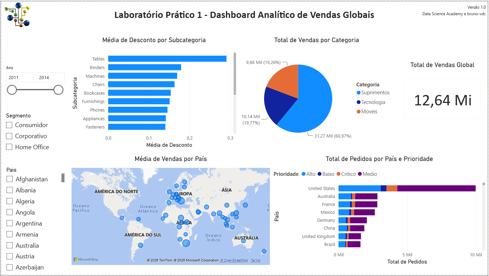

##### **Dados e Modelos de Dados**

| ID_Pedido      | Data_Pedido | ID_Cliente | Segmento    | Regiao     | Pais          | Product ID      | Categoria   | SubCategoria | Total_Vendas | Quantidade | Desconto |   Lucro | Prioridade |
| -------------- | ----------- | ---------- | ----------- | ---------- | ------------- | --------------- | ----------- | ------------ | -----------: | ---------: | -------: | ------: | ---------- |
| US-2012-129007 | 13/09/2012  | KD-16615   | Corporativo | California | United States | OFF-PA-10000994 | Suprimentos | Paper        |       209,70 |          2 |        0 | 100,656 | Critico    |
| CA-2014-11671  | 03/09/2014  | VW-21775   | Corporativo | California | United States | OFF-PA-10004475 | Suprimentos | Paper        |       109,92 |          2 |        0 | 53,8608 | Alto       |
| CA-2013-159345 | 18/06/2013  | IG-15085   | Consumidor  | California | United States | OFF-PA-10000806 | Suprimentos | Paper        |       111,96 |          2 |        0 | 54,8604 | Alto       |
| CA-2014-124716 | 28/03/2014  | BD-11560   | Home Office | California | United States | OFF-PA-10001144 | Suprimentos | Paper        |       110,96 |          2 |        0 | 53,2608 | Alto       |
| CA-2013-106460 | 16/02/2013  | GT-14710   | Consumidor  | California | United States | OFF-PA-10001736 | Suprimentos | Paper        |        70,88 |          2 |        0 | 33,3136 | Critico    |

##### **Perguntas**

1. Qual o valor total vendido?
2. Quantas vendas foram realizadas por categoria de produto?
3. Quantas vendas foram realizadas por país considerando a prioridade de entrega?
4. Qual foi a média de desconto nas vendas por subcategoria de produto?
5. Quais países tiveram maior média de valor de venda? Demonstre em um mapa.

---
### **lab2: Laboratório Prático 2 - Dashboard de Vendas, Custo, Margem de Lucro e KPI**

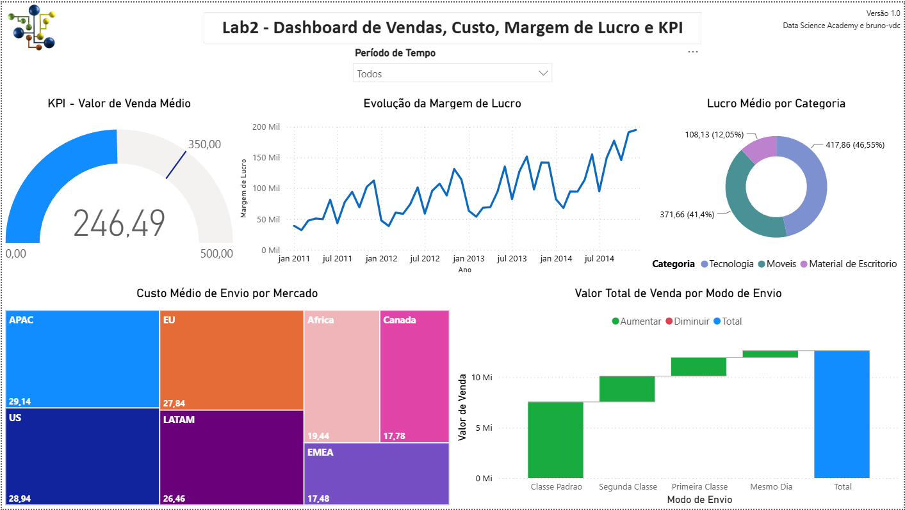

##### **Dados e Modelos de Dados**

Esse relatório possui 4 fontes de dados, que formam um modelo relacional.  
As relações indicadas com *Corrigido* foram criadas no decorrer das aulas, devido a erros intencionalmente colocados nos dados para trabalhar ajustes finos neles.  
Entretanto, as bases originais ainda podem ser consultadas. 

Abaixo está o modelo de dados final:

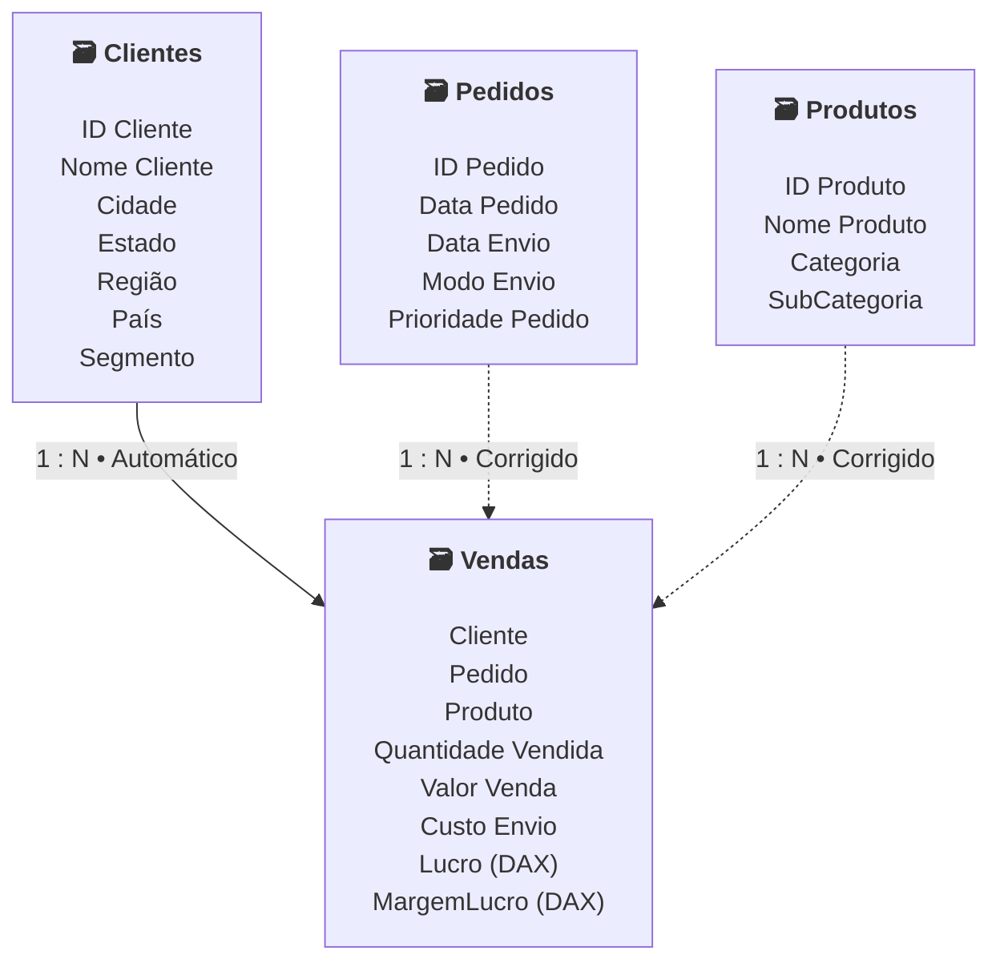

##### **Perguntas**

1. Qual foi o total de valor venda considerando cada modo de envio dos pedidos? Use um gráfico de cascata.
2. Quais mercados tiveram o maior custo médio de envio dos produtos vendidos? Use um gráfico treemap.
3. A empresa tem como objetivo (meta) manter uma média de 350 para o valor de venda todos os meses. Mostre um indicador (KPI – Key Performance Indicator) com o valor médio de venda. A empresa ficou abaixo ou acima da meta no mês de Abril/2014?
4. Considere que o lucro é equivalente a: valor venda - custo envio. Qual categoria de produto apresentou maior lucro médio.
5. Qual foi o comportamento da margem de lucro ao longo do tempo? Considere a margem de lucro como o lucro dividido pelo valor venda.

---
### **mp1: Miniprojeto 1 - Análise de Campanhas de Marketing com Power BI**

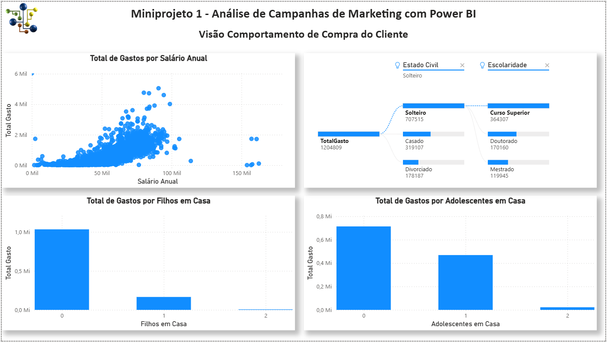

Print da aba `Visão Comportamento`. Há outras 3 abas no relatório.

##### **Dados e Modelos de Dados**

| ID | Ano Nascimento | Escolaridade | Estado Civil | Salario Anual | Filhos em Casa | Adolescentes em Casa | Data Cadastro | Dias Desde Ultima Compra | Gasto com Eletronicos | Gasto com Brinquedos | Gasto com Moveis | Gasto com Utilidades | Gasto com Alimentos | Gasto com Vestuario | Numero de Compras com Desconto | Numero de Compras na Web | Numero de Compras via Catalogo | Numero de Compras na Loja | Numero Visitas WebSite Mes |Compra na Campanha 1 | Compra na Campanha 2 | Compra na Campanha 3 | Compra na Campanha 4 | Compra na Campanha 5 | Comprou | Pais |  
|---:|---:|---|---|---:|---:|---:|---|---:| ---:|---:|---:|---:|---:|---:|---:|---:|---:|---:|---:|---:|---:|---:|---:|---:|---|---|
| 5758 | 1982 | Curso Superior | Solteiro | 65169 | 0 | 0 | segunda-feira, 1 de fevereiro de 2021 | 23 | 1074 | 0 | 69 | 0 | 0 | 46 | 1 | 10 | 4 | 13 | 6 |1 | 0 | 1 | 1 | 1 | Sim | Estados Unidos |
| 9855 | 1952 | Doutorado | Solteiro | 62000 | 0 | 1 | sábado, 8 de abril de 2023 | 25 | 899 | 0 | 101 | 0 | 0 | 20 | 1 | 6 | 6 | 13 | 4 |0 | 0 | 0 | 0 | 0 | Não | Estados Unidos |
| 10022 | 1973 | Doutorado | Solteiro | 54466 | 1 | 1 | domingo, 2 de setembro de 2018 | 78 | 12 | 0 | 4 | 0 | 0 | 0 | 1 | 1 | 0 | 2 | 5 |0 | 0 | 0 | 0 | 0 | Não | Estados Unidos |
| 10350 | 1950 | Doutorado | Solteiro | 54432 | 2 | 1 | sábado, 5 de setembro de 2020 | 37 | 33 | 0 | 5 | 0 | 0 | 0 | 1 | 1 | 0 | 3 | 4 |0 | 0 | 0 | 0 | 0 | Não | Estados Unidos |
| 5062 | 1963 | Doutorado | Solteiro | 54072 | 1 | 1 | terça-feira, 7 de março de 2023 | 71 | 35 | 0 | 4 | 0 | 0 | 0 | 1 | 2 | 0 | 2 | 8 |0 | 0 | 0 | 0 | 0 | Não | Espanha |

##### **Perguntas**

Não foram feitas perguntas, mas foi solicitado a criação de 4 diferentes visões, que tornaram-se, cada uma, uma página no relatório. As visões pedidas são:

1. Visão do Cliente
2. Visão do Comportamento de Compra do Cliente
3. Visão da Performance das Campanhas de Marketing
4. Visão dos Padrões de Compra no Ponto de Venda (País)

---
### **mp2: Miniprojeto 2 - Dashboard Comercial - Performance de Vendas**

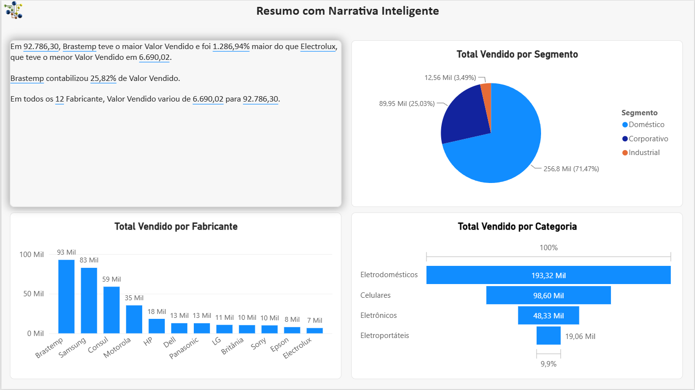

Print da aba `Resumo`. Há outras 4 abas no relatório.

##### **Dados e Modelos de Dados**

| ID-Produto | Produto | Categoria | Segmento | Fabricante | Loja | Cidade | Estado | Vendedor | ID-Vendedor | Comissão (Percentual) | Data Venda | ValorVenda | Custo |
|---|---|---|---|---|---|---|---|---|---:|---:|---|---:|---:|
| SKU-0000025 | Lavadora 11 Kg | Eletrodomésticos | Doméstico | Brastemp | SP8821 | São Paulo | São Paulo | Artur Moreira | 1004 | 2 | quarta-feira, 2 de outubro de 2013 | 789,34 | 120 |
| SKU-0000033 | Geladeira Duplex | Eletrodomésticos | Doméstico | Brastemp | SP8823 | São Paulo | São Paulo | Maria Fernandes | 1001 | 2 | domingo, 2 de junho de 2013 | 1245,9 | 120 |
| SKU-0000034 | Geladeira Duplex | Eletrodomésticos | Doméstico | Brastemp | SP8823 | São Paulo | São Paulo | André Pereira | 1002 | 2 | terça-feira, 2 de julho de 2013 | 1345,87 | 120 |
| SKU-0000035 | Geladeira Duplex | Eletrodomésticos | Doméstico | Brastemp | SP8823 | São Paulo | São Paulo | Mateus Gonçalves | 1003 | 2 | sexta-feira, 2 de agosto de 2013 | 1234,12 | 120 |
| SKU-0000039 | Geladeira Duplex | Eletrodomésticos | Doméstico | Brastemp | SP8823 | São Paulo | São Paulo | Fernando Zambrini | 1007 | 2 | segunda-feira, 2 de dezembro de 2013 | 1245,9 | 120 |

---
### **mp3: Miniprojeto 3 - Análise de Dados de RH com Power BI**

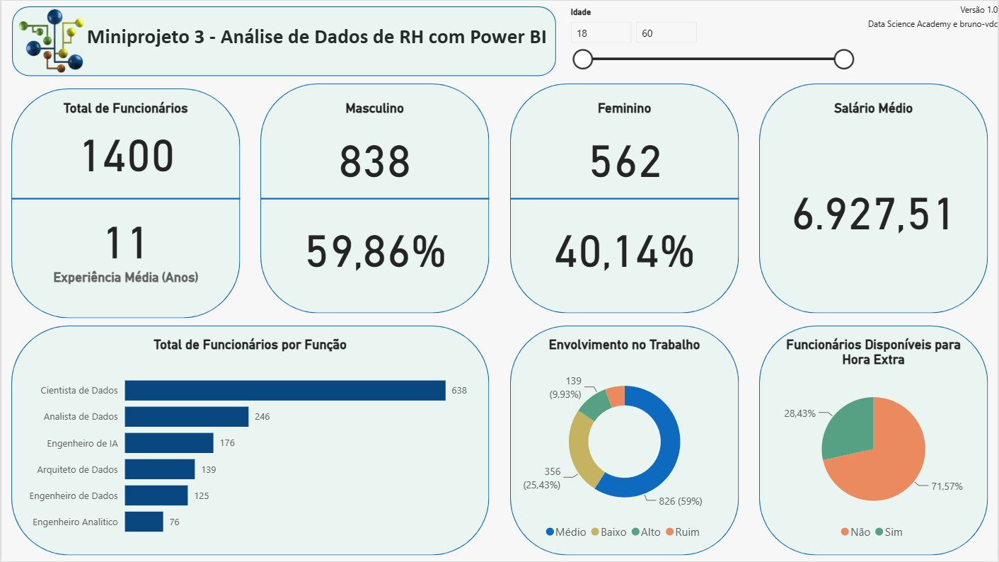

##### **Dados e Modelos de Dados**

| Id_Funcionario | Idade | Genero | Estado Civil | Departamento | Funcao | Viagem | Valor Diaria | Indice_Envolvimento_Trabalho | Nivel_Satisfacao_Trabalho | Salario_Mensal | Numero_Empresas_Anteriores | Disponivel_Hora_Extra | Percentual_Ultimo_Aumento_Salario | Aval_Performance | Anos_Experiencia | Numero_Treinamentos_Ano_Anterior | Anos_na_Empresa | Anos_Funcao_Atual | Anos_Desde_Ultima_Promocao | Anos_com_Gerente_Atual | StatusPromo | envolvimento_trabalho |
|---:|---:|---|---|---|---|---|---:|---:|---:|---:|---:|---|---:|---:|---:|---:|---:|---:|---:|---:|---|---|
| 10 | 59 | Feminino | Casado | Data Science | Analista de Dados | Viaja Raramente | 1324 | 4 | 1 | 12670 | 4 | Sim | 20 | 4 | 12 | 3 | 1 | 0 | 0 | 0 | Não Considerar Promoção | Alto |
| 11 | 30 | Masculino | Divorciado | Data Science | Analista de Dados | Viaja Raramente | 1358 | 3 | 3 | 12693 | 4 | Não | 22 | 4 | 12 | 2 | 1 | 0 | 0 | 0 | Não Considerar Promoção | Médio |
| 22 | 22 | Masculino | Divorciado | Data Science | Analista de Dados | Apenas Local | 1123 | 4 | 4 | 12935 | 1 | Sim | 13 | 3 | 1 | 2 | 1 | 0 | 0 | 0 | Não Considerar Promoção | Alto |
| 42 | 39 | Masculino | Casado | Data Science | Engenheiro de IA | Viaja Raramente | 895 | 3 | 4 | 12086 | 3 | Não | 14 | 3 | 19 | 6 | 1 | 0 | 0 | 0 | Não Considerar Promoção | Médio |
| 53 | 35 | Masculino | Divorciado | Data Science | Analista de Dados | Viaja Raramente | 464 | 3 | 4 | 1951 | 1 | Não | 12 | 3 | 1 | 3 | 1 | 0 | 0 | 0 | Não Considerar Promoção | Médio |

##### **Perguntas**

1. Qual o total de funcionários atualmente na empresa?
2. Qual o tempo médio de experiência dos funcionários (em anos)?
3. Qual o total e percentual de funcionários do gênero masculino e feminino?
4. Qual a média salarial mensal?
5. Qual o total de funcionários por função?
6. Qual o percentual de funcionários disponíveis para fazer hora extra?
7. Qual o nível de envolvimento dos funcionários no trabalho considerando 4 categorias:
Ruim, Baixo, Médio e Alto?
8. Este item não deve estar no Dashboard, mas precisa ser calculado: Qual o total e o percentual de funcionários que devem receber promoção? Considere a coluna “Anos Desde a última Promoção” com a seguinte regra: Se o funcionário tiver 5 anos ou mais desde a última promoção, deve ter a promoção considerada. Caso contrário, a promoção não deve ser considerada agora.

---
### **mp4: Miniprojeto 4 - Análise de Dados de Logística**

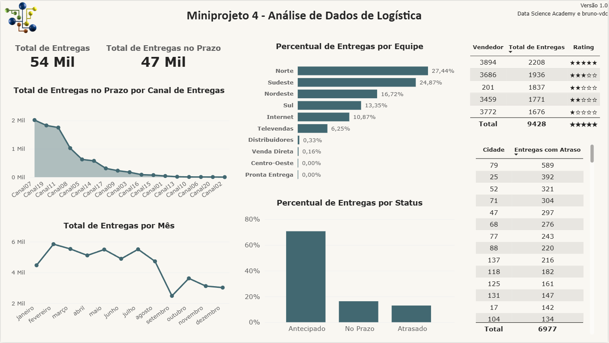

##### **Dados e Modelos de Dados**

| ID_Pedido | ID_Vendedor | ID_Cliente | Equipe_Entrega | Cliente | Canal_Entrega | ID_Cidade | Data_Pedido | Data_Entrega_Prevista | Data_Entrega_Realizada | Status_Entrega |
|---:|---:|---:|---|---|---|---:|---|---|---|---|
| 5627386 | 3459 | 49090 | Norte | Cliente 381 | Canal12 | 79 | segunda-feira, 16 de dezembro de 2019 | sexta-feira, 20 de dezembro de 2019 | quarta-feira, 18 de dezembro de 2019 | Antecipado |
| 5621179 | 3459 | 49090 | Norte | Cliente 381 | Canal12 | 79 | segunda-feira, 9 de dezembro de 2019 | sexta-feira, 13 de dezembro de 2019 | quarta-feira, 11 de dezembro de 2019 | Antecipado |
| 5615881 | 3459 | 49090 | Norte | Cliente 381 | Canal12 | 79 | segunda-feira, 2 de dezembro de 2019 | sexta-feira, 6 de dezembro de 2019 | quarta-feira, 4 de dezembro de 2019 | Antecipado |
| 5609975 | 3459 | 49090 | Norte | Cliente 381 | Canal12 | 79 | segunda-feira, 25 de novembro de 2019 | sexta-feira, 29 de novembro de 2019 | quarta-feira, 27 de novembro de 2019 | Antecipado |
| 5609976 | 3459 | 49090 | Norte | Cliente 381 | Canal12 | 79 | segunda-feira, 25 de novembro de 2019 | sexta-feira, 29 de novembro de 2019 | quarta-feira, 27 de novembro de 2019 | Antecipado |

##### **Perguntas**

1. Total de Entregas no Prazo Por Canal de Entrega
2. Percentual de Entregas Antecipadas Por Equipe de Entrega
3. Total de Entregas Por Mês
4. Total de Entregas de Produtos dos Top 5 Vendedores
5. Total de Entregas com Atraso Por Cidade
6. Percentual de Entregas Por Status de Entrega

---
### **mp5: Miniprojeto 5 - Dashboard de Análise Financeira**

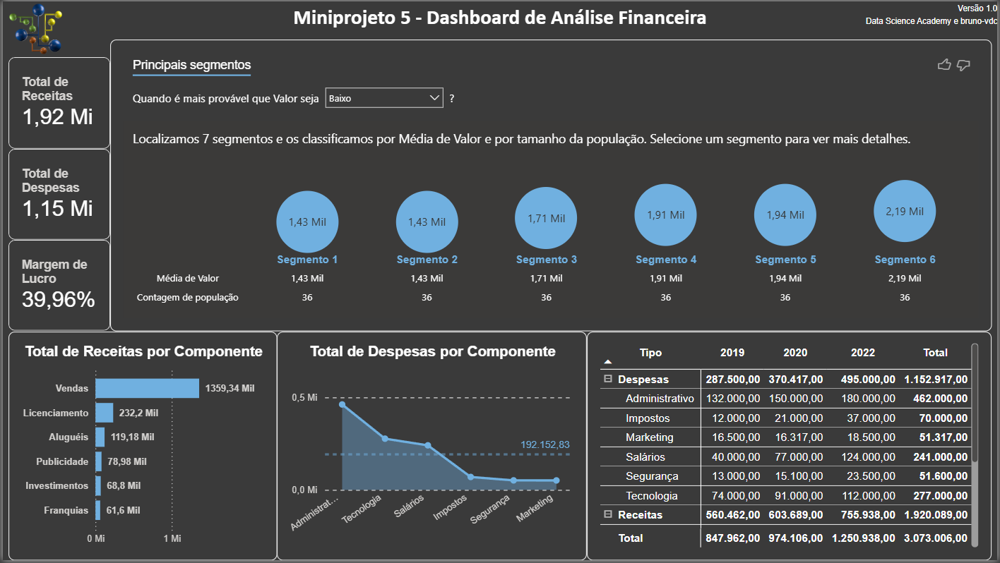

##### **Dados e Modelos de Dados**

| Tipo | Componente | Data | Valor |
|---|---|---|---:|
| Receitas | Vendas | terça-feira, 1 de janeiro de 2019 | 30000 |
| Receitas | Vendas | sexta-feira, 1 de fevereiro de 2019 | 324569,6 |
| Receitas | Vendas | sexta-feira, 1 de março de 2019 | 331283,4 |
| Receitas | Vendas | segunda-feira, 1 de abril de 2019 | 33560 |
| Receitas | Vendas | quarta-feira, 1 de maio de 2019 | 33890,76 |

##### **Perguntas**

1. Total de Receitas
2. Total de Despesas
3. Margem de Lucro
4. Total de Receitas Por Componente
5. Total de Despesas Por Componente em relação à média de Despesas
6. Total de Receitas e Despesas Por Componente e Por Ano, com a hierarquia Tipo/Componente.

---
### **lab3: Laboratório Prático 3 - Balanço Patrimonial com Visual de Matriz**

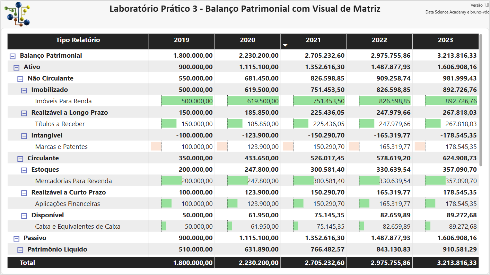

##### **Dados e Modelos de Dados**

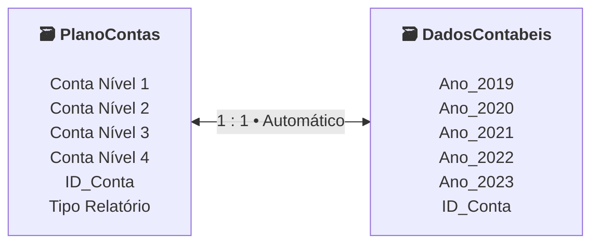

---
### **mp6: Miniprojeto 6 - Dashboard Analítico do Mercado de Ações**

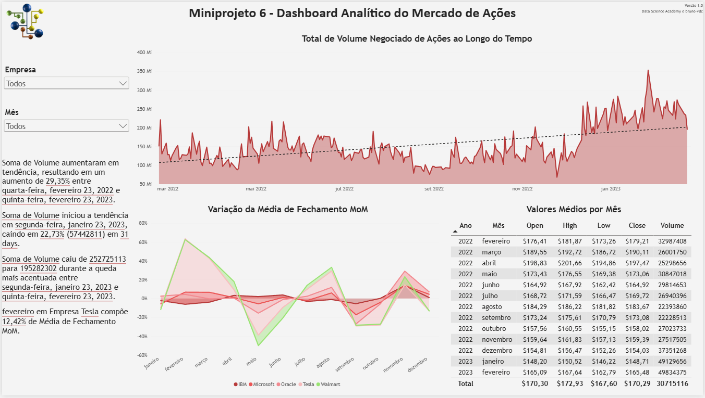

##### **Dados e Modelos de Dados**

| Empresa | Data | Close | Volume | Open | High | Low |
|---|---|---:|---:|---:|---:|---:|
| IBM | quinta-feira, 23 de fevereiro de 2023 | 130,79 | 3725648 | 131,5 | 131,7 | 128,86 |
| IBM | quarta-feira, 22 de fevereiro de 2023 | 130,97 | 3200185 | 131,9 | 131,99 | 130,29 |
| IBM | terça-feira, 21 de fevereiro de 2023 | 131,71 | 4257210 | 134 | 134,385 | 131,66 |
| IBM | sexta-feira, 17 de fevereiro de 2023 | 135,02 | 3466184 | 134,5 | 135,58 | 133,89 |
| IBM | quinta-feira, 16 de fevereiro de 2023 | 135 | 2965495 | 135,57 | 135,9672 | 134,59 |

##### **Perguntas**

1. Qual o total de volume negociado de ações ao longo do tempo para as 5 empresas que estão sendo analisadas? Permita que essa análise seja feita para uma única empresa ou combinação de empresas.
2. Qual o valor médio de abertura (Open), mais alto (High), mais baixo (Low) e de fechamento (Close) das ações de todas as empresas para todos os meses do período de dados analisado (1 ano em nosso exemplo)? Mostre no formato de tabela e permita que essa análise seja feita para uma única empresa ou combinação de empresas.
3. Qual a variação da média do valor de fechamento (close) das ações de todas as empresas ao longo do tempo, mês a mês? Permita que essa análise seja feita para uma única empresa ou combinação de empresas.
4. Use a Narrativa Inteligente para explicar as principais características e tendências nos dados.
5. O Dashboard deve ser formatado.